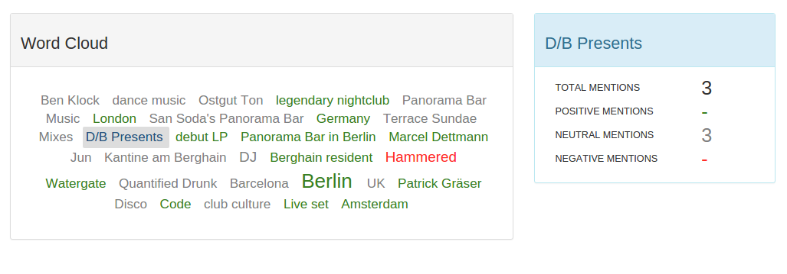

# word-cloud

Creates a word cloud from a given json file like this:

Demo is [here](http://crop.floodbit.org/~chudaol/wordcloud/index.html)

## To run locally:
    
    > sh run.sh

And open your browser on localhost:8080

## Tests and Lint
### Code Linting:
Run

    > npm run lint
    
### To run tests:
Run

    > npm test